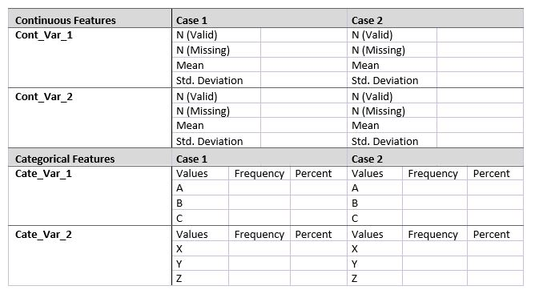
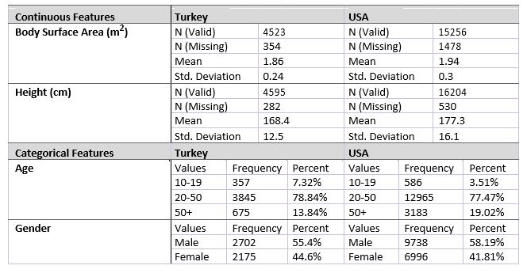
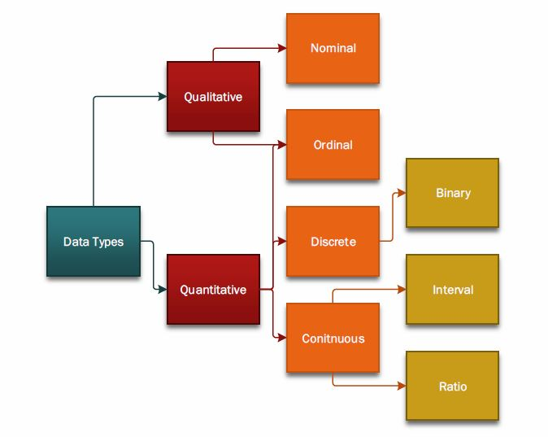
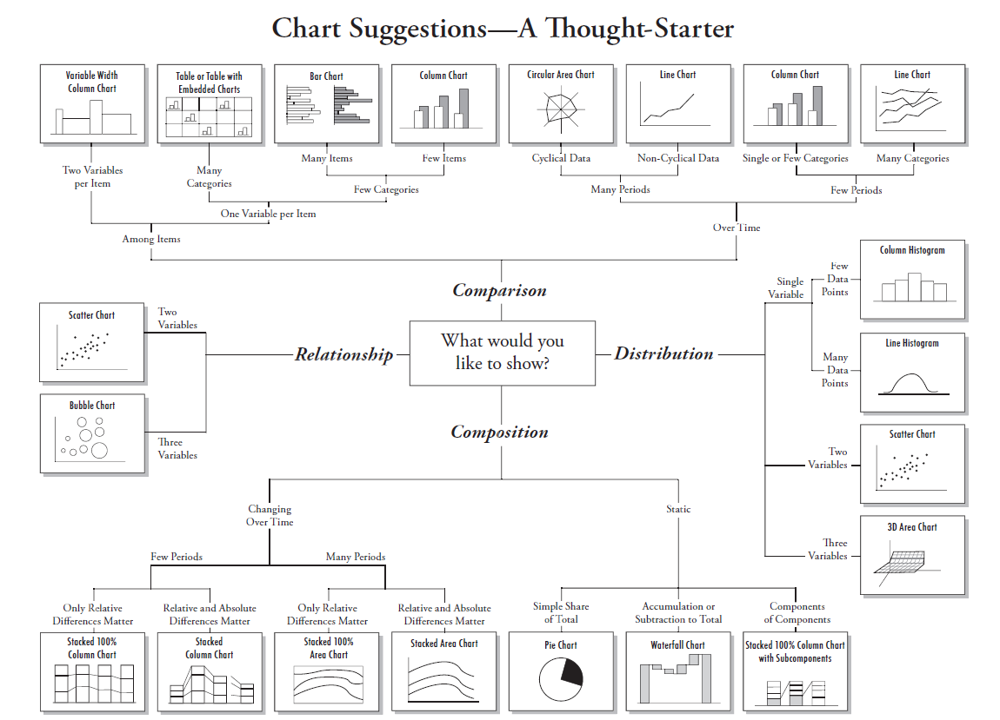

**Objectives:**

The objective of this document is to give an introduction to data visualization and ggplot2 package in R. Another objective of this document is to explain descriptive statistics and how to obtain them. This document assumes the users have completed the previous tutorial which was about R and Rstudio. After completing this tutorial, you will be able to:

* Obtain descriptive statistics of data
*	Identify appropriate plots for different data types 
* Generate plots using `ggplot2`
* Modify plots using `ggplot2`

## Descriptive Statistics

Descriptive statistics are designed to give you an overview of the data you are analyzing. It tells you where the data is centered (central tendency), dispersion of the data, if you have any outliers, what is the shape of the distribution of your data etc.
 

Descriptive statistics are crucial in determination of the appropriate analysis for your data. Initial data visualization and descriptive statistics are part of “Exploratory Data Analysis”.

### Central Tendency

Central tendency tells you where the center of your data is. Mean, median, trimmed mean etc. are all measures of central tendency and they are appropriate to use for differently characterized data.

One of the first impressions that we like to get from a variable is its general location. You might think of this as the center of the variable on the number line. The average (mean) is a common measure of location. When investigating the center of a variable, the main descriptors are the mean, median, mode, and the trimmed mean.

Other averages, such as the geometric and harmonic mean, have specialized uses. We will now briefly compare these measures.

If the data come from the normal distribution, the mean, median, mode, and the trimmed mean are all equal. If the mean and median are very different, most likely there are outliers in the data or the distribution is skewed. If this is the case, the median is probably a better measure of location. The mean is very sensitive to extreme values and can be seriously contaminated by just one observation.

A compromise between the mean and median is given by the trimmed mean (where a predetermined number of observations are trimmed from each end of the data distribution). This trimmed mean is more robust than the mean but more sensitive than the median. Comparison of the trimmed mean to the median should show the trimmed mean approaching the median as the degree of trimming increases. If the trimmed mean converges to the median for a small degree of trimming, say 5 or 10%, the number of outliers is relatively few.


### Dispersion

After establishing the center of a variable’s values, the next question is how closely the data fall about this center. The pattern of the values around the center is called the spread, dispersion, or variability. There are numerous measures of variability: range, variance, standard deviation, interquartile range, and so on. All of these measures of dispersion are affected by outliers to some degree, but some do much better than others.

The standard deviation is one of the most popular measures of dispersion. Unfortunately, it is greatly influenced by outlying observations and by the overall shape of the distribution. Because of this, various substitutes for it have been developed. It will be up to you to decide which is best in a given situation.


### Shape

The shape of the distribution describes the pattern of the values along the number line. Are there a few unique values that occur over and over, or is there a continuum? Is the pattern symmetric or asymmetric? Are the data bell shaped? Do they seem to have a single center or are there several areas of clumping? These are all aspects of the shape of the distribution of the data. Two of the most popular measures of shape are skewness and kurtosis. Skewness measures the direction and lack of symmetry.
 

The more skewed a distribution is, the greater the need for using robust estimators, such as the median and the interquartile range. Positive skewness indicates a longtailedness to the right while negative skewness indicates longtailedness to the left. Kurtosis measures the heaviness of the tails. A kurtosis value less than three indicates lighter tails than a normal distribution. Kurtosis values greater than three indicate heavier tails than a normal distribution. The measures of shape require more data to be accurate. For example, a reasonable estimate of the mean may require only ten observations in a random sample. The standard deviation will require at least thirty. A reasonably detailed estimate of the shape (especially if the tails are important) will require several hundred observations.


### Outliers

Outliers in a univariate data set are defined as observations that appear to be inconsistent with the rest of the data. An outlier is an observation that sticks out at either end of the data set.

The visualization of univariate outliers can be done in three ways: with the stem-and-leaf plot, with the box plot, and with the normal probability plot. In each of these informal methods, the outlier is far removed from the rest of the data. A word of caution: the box plot and the normal probability plot evaluate the potentiality of an outlier assuming the data are normally distributed. If the variable is not normally distributed, these plots may indicate many outliers. You must be careful about checking what distributional assumptions are behind the outliers you may be looking for.

Outliers can completely distort descriptive statistics. For instance, if one suspects outliers, a comparison of the mean, median, mode, and trimmed mean should be made. If the outliers are only to one side of the mean, the median is a better measure of location. On the other hand, if the outliers are equally divergent on each side of the center, the mean and median will be close together, but the standard deviation will be inflated. The interquartile range is the only measure of variation not greatly affected by outliers. Outliers may also contaminate measures of skewness and kurtosis as well as confidence limits.

This discussion has focused on univariate outliers, in a simplistic way. If the data set has several variables, multiple regression and multivariate methods must be used to identify these outliers.


### Summary

The table below explains the most widely used descriptive statistics, their R codes and their appropriate use. We will explore this further in the class.

<table>
<colgroup>
<col width="30%" />
<col width="43%" />
<col width="30%" />
</colgroup>
<thead>
<tr class="header">
<th align="left">Statistic</th>
<th align="left">R Function</th>
<th align="left">Usage</th>
</tr>
</thead>
<tbody>
<tr class="odd">
<td align="left">Central Tendency<br />
* Mean <br />
* Harmonic mean <br />
* Geometric mean
</td>
<td align="left">  <br />
mean(x)<br />
median(x)<br />
exp(mean(log(x)))</td>
<td align="left"> <br />
Normal data<br />
Data with outliers/non-normal<br />
Data with outliers/non-normal<br />
</td>
</tr>
<tr class="even">
<td align="left">Dispersion<br />
* Range <br />
* Interquantile range <br />
* Variance <br />
* Standard deviation
</td>
<td align="left"> <br />
range(x), max(x) – min(x)<br />
quantile(x, c(0.25, 0.75))<br />
var(x)<br />
sd(x)</td>
<td align="left"><br />
Good for checking data<br />
Useful for non-normal data<br />
Statistically relevant<br />
Useful for non-normal data</td>
</tr>
<tr class="odd">
<td align="left">Shape<br />
* Histogram <br />
* Skewness <br />
* Kurtosis
</td>
<td align="left"> <br />
hist(x) or qplot, see  Histograms and Density Plots<br />
skewness(x) (in “e1071” package)<br />
kurtosis(x) (in “e1071” package)</td>
<td align="left"><br />
To visualize the data<br />
To calculate skewness<br />
To calculate kurtosis<br />
</td>
</tr>
<tr class="even">
<td align="left">Outlier detection<br />
* Box-Whisker Plots 
</td>
<td align="left"> <br />
boxplot(x) or see  Box-Whisker Plots (Box-Plots)</td>
<td align="left"><br />
Shows the median, 1st and 3rd quantiles, outliers
</td>
</tr>
<tr class="odd">
<td align="left">Normality testing<br />
* Q-Q Plot 
</td>
<td align="left"> <br />
qqnorm(x)</td>
<td align="left"><br />
Shows the qqplot for normal distribution and the data
</td>
</tr>
</tbody>
</table>

Following code shows how to perform descriptive statistics in R.

First, install and load the packages.

```{r, message=FALSE, warning=FALSE}
#check if package is already installed. If not, install the package
if("e1071" %in% rownames(installed.packages())==FALSE){
  install.packages("e1071")
}

#load the package
require("e1071")
require("ggplot2")
```


Then, subset some data.

```{r, message=FALSE, warning=FALSE}
dsmall<-diamonds[sample(nrow(diamonds),100),]
desc_data<-dsmall$carat
```

Let's calculate the mean, median, 1st and 3rd quartiles and the standard deviation of the `desc_data` dataset.

```{r, message=FALSE, warning=FALSE}
summary(desc_data)
```

Calculate skewness and kurtosis. These are the shape parameters. In Gaussian (Normal) Distribution, these values are 0 and 1 respectively.
```{r, message=FALSE, warning=FALSE}
skewness(desc_data)
```

```{r, message=FALSE, warning=FALSE}
kurtosis(desc_data)
```

Let’s make a histogram using the base plotting system of R. In the future, we will use ggplot2 system which is explained in the following sections of this tutorial.

```{r, message=FALSE, warning=FALSE, fig.align='center'}
hist(desc_data)
```

Let’s make a Box-Plot of the data. The circles outside the box range are outliers.

```{r, message=FALSE, warning=FALSE, fig.align='center'}
boxplot(desc_data)
```

Let’s see if the data is normal. If the plot is not distributed over a 45 degree line, then it is not normal.

```{r, message=FALSE, warning=FALSE, fig.align='center'}
qqnorm(desc_data)
qqline(desc_data)
```

### Reporting Format
When reporting descriptive statistics, please use the following format:


Sample Table:


## Data Visualization

Data visualization is depicting data in a compact way using visual tools such as infographics and plots. Data visualization is important because, effective visualization helps users to see the patterns and changes in the data. It makes complex data more accessible, understandable and usable.

Data visualization techniques differ based on the type of data that you are aiming to visualize. First, this document explains the data types and their properties. Later, this document will introduce the different types of visualizations. Finally, the document will explain which type of visualization is appropriate for which type of data.

### Data Types

Data types are usually divided into two categories as *Qualitative* and *Quantitative* data types. Some researchers categorize *Binary* data types as *Qualitative*.



**Qualitative Data**: Data that approximates or characterizes *but does not measure* the attributes, characteristics, properties, etc., of a thing or phenomenon. Qualitative data is *descriptive data*. (Business Dictionary)

* **Nominal Data**: Nominal means “relating to names”. The nominal data is the type of data that is a name for something. They usually comprise of strings. *They have no particular order.*

* **Ordinal Data**: Ordinal data is the type of qualitative data that has a specific order. (Small, medium, large or 1st place, 2nd place, etc.)

**Numeric (Quantitative) Data**: Data that is a numerical measurement or numerical depiction of some attribute.

* **Discrete Data**: Discrete data is the numeric data which has only integer values. They usually represent count.
    + **Binary Data**: Data that can only take two values. Sometimes binary data types can be represented as categorical (nominal) variables such as “Yes” and “No”. They can be converted to discrete representation.

* **Continuous Data**: Numeric data that has real values.
    + **Interval**: Data that allow us to compare difference between values such as temperature data. Say the temperature is 25 C. This means that, the temperature have risen from the freezing point of water for an interval value of 25. The scale (under what condition or how 1 degree change happens) is determined by researchers. There are other scales for measuring temperature such as Kelvin or Fahrenheit. 1 degree change represents a different interval in each of those scales.
    + **Ratio**: Magnitude of some value compared to another. For instance 10 K is 2 times 5 K. 2 is the ratio value.

* **Ordinal Data**: Ordinal data is the type of quantitative data that has a specific order. (Run time: 1.2	seconds, 0.9 seconds etc. when determining the fastest algorithm)

### Plot Types

**Histograms**: In general, histograms are used to examine frequency distributions of values of variables. For example, the frequency distribution plot shows which specific values or ranges of values of the examined variable are most frequent, how differentiated the values are, whether most observations are concentrated around the mean, whether the distribution is symmetrical or skewed, whether it is multimodal (i.e., has two or more peaks) or unimodal, etc. Histograms are also useful for evaluating the similarity of an observed distribution with theoretical or expected distributions.

**Scatterplots**: In general, two-dimensional scatterplots are used to visualize relations between two variables X and Y (e.g., weight and height). In scatterplots, individual data points are represented by point markers in two-dimensional space, where axes represent the variables. The two coordinates (X and Y) which determine the location of each point correspond to its specific values on the two variables. If the two variables are strongly related, then the data points form a systematic shape (e.g., a straight line or a clear curve). If the variables are not related, then the points form a round "cloud."

**Q-Q Plots (Quantile – Quantile Plots)**: In general, Q-Q plots are used to compare the distributions of two variables.

**P-P Plots (Probability – Probability Plots)**: Probability-Probability (or P-P) plot is useful for determining how well a specific theoretical distribution fits the observed data.

**Line Plots**: In line plots, individual data points are connected by a line. Line plots provide a simple way to visually present a sequence of many values (e.g., stock market quotes over a number of days).

**Box Plots**: In Box Plots the central tendency (e.g., median or mean), and range or variation statistics (e.g., quartiles, standard errors, or standard deviations) are computed, and the selected values are presented in one of five styles (Box Whiskers, Whiskers, Boxes, Columns, or High-Low Close). Outlier data points can also be plotted.

**Pie Charts**: Pie charts depict the percentage or the ratio information of the given (usually categorical or discrete) data. (Dell)

**Heat Maps**: A heat map is a two-dimensional representation of data in which values are represented by colors. Most of the time, heat maps depict the density of values in a particular 2d range. The locations where there is more data than others are “heated” towards a red color while other, sparser areas are “cooled” towards a blue color.

### Best Practices When Visualizing Data

There are some widely accepted best practices when using data plots. Each plot is intended for a main purpose so it is best to use those plots for their intended purpose. The figure below (Abela, 2006) explains the best usage of different plot types.



The most commonly used graphics and their intended usage is given in the table below.

<table>
<colgroup>
<col width="30%" />
<col width="43%" />
</colgroup>
<thead>
<tr class="header">
<th align="left">Plot Type</th>
<th align="left">Usage</th>
</tr>
</thead>
<tbody>
<tr class="odd">
<td align="left">Scatter plot
</td>
<td align="left">Relationship between two variables</td>
</tr>
<tr class="even">
<td align="left">Histogram
</td>
<td align="left">To see the distribution of data in defined bins</td>
</tr>
<tr class="odd">
<td align="left">Bar chart
</td>
<td align="left">To see the frequency of data in categories (similar to histogram)</td>
</tr>
<tr class="even">
<td align="left">Line plot
</td>
<td align="left">To see the trend in data through a sequence</td>
</tr>
<tr class="odd">
<td align="left">Pie chart
</td>
<td align="left">To see the ratio/percentage</td>
</tr>
<tr class="even">
<td align="left">Q-Q Plot
</td>
<td align="left">To see the difference between distributions of two variables</td>
</tr>
<tr class="odd">
<td align="left">P-P plot
</td>
<td align="left">To see the goodness of fit of a theoretical distribution to some data
</td>
</tr>
<tr class="even">
<td align="left">Box plot
</td>
<td align="left">To see the dispersion and location parameters of data
</td>
</tr>
</tbody>
</table>

## ggplot2 Tutorial

This tutorial explains the usage of qplot and ggplot funtions. For help on these functions, type `?qplot` or `?ggplot` to the console.

First install and load the package.

```{r, message=FALSE, warning=FALSE}
#check if package is already installed. If not, install the package
if("ggplot2" %in% rownames(installed.packages())==FALSE){
  install.packages("ggplot2")
}

#load the package
require("ggplot2") #or you can use library(ggplot2)
```

Let's load and sample the diamonds dataset included in the `ggplot2` package.

```{r, message=FALSE, warning=FALSE}
set.seed(5) #Setting the seed ensures you get the same sample values everytime you sample the dataset. Otherwise, each sample will be different. We use seeds to make sure the analysis is reproducible by other people who want to use your methods. 

#The sample function takes the number of observations (nrow(diamonds)) in diamonds dataset, and generates 100 randomly selected indexes. diamonds[sample(nrow(diamonds), 100)] code allows us to obtain only the values at generated indexes in the diamonds dataset. And then we assign those to the `dsmall` variable which is the dataset that we will use in this tutorial. 
dsmall <- diamonds[sample(nrow(diamonds), 100),]
```

Let's overview the dsmall data frame.

```{r, message=FALSE, warning=FALSE}
View(dsmall) #This will show the data along with the rows that were sampled. the `row.names` column is NOT part of the dataset. It is just the information RStudio is giving you.

head(dsmall, n=10) #This shows the first 10 entries in the data. The default is n=6.
```

```{r, message=FALSE, warning=FALSE}
summary(dsmall) #This shows the summary of the variables in `dsmall` dataset.
```

### qplot Application 

#### Scatterplot

Let's draw some plots using `qplot` function. Qplot generates a scatter plot by default when x and y are both provided. It generates a histogram by default when only x is provided.

```{r, message=FALSE, warning=FALSE, fig.align='center'}
#Let's draw a scatter plot that shows the relation between carat and price variables
qplot(carat, price, data = dsmall) #qplot(x, y, data = name_of_dataset)
```

There seems to be a non-linear relationship with the carat and the price of the diamond.

To see if we can linearize the relationship, we need to see if log transform of the data helps. At this point, don't worry about transformations, they will be explained in the future lectures.

```{r, message=FALSE, warning=FALSE, fig.align='center'}
#Let's draw a scatter plot that shows the relation between carat and price variables
qplot(log(carat), log(price), data = dsmall)
```

Now the relationship looks linear. However, the labels are not very nice, so we need to define axis labels and a title.

```{r, message=FALSE, warning=FALSE, fig.align='center'}
qplot(log(carat), log(price), data = dsmall, xlab = "Natural Log of Carat",
      ylab = "Natural Log of Price",
      main = "Relationship Between Carat and Price")
```

As we have seen in the descriptive statistics, the diamonds have different color qualities and different cut qualities depicted with `color` and `cut` attributes in the dataset respectively. Assume that we want to see the effect of `cut` in Carat - Price Relationship, then we should change the of data points in the plot.


```{r, message=FALSE, warning=FALSE, fig.align='center'}
qplot(log(carat), log(price), data = dsmall, colour = cut, xlab = "Natural Log of Carat", 
      ylab = "Natural Log of Price", main = "Relationship Between Carat and Price")
```

Or alternatively, you can change the shape of the data points if you don't want colors. This is usually the case when you want to make your document appropriate for black and white printing. In black and white documents, color differences may not be visible.

```{r, message=FALSE, warning=FALSE, fig.align='center'}
qplot(log(carat), log(price), data = dsmall, shape = cut, xlab = "Natural Log of Carat", 
      ylab = "Natural Log of Price", main = "Relationship Between Carat and Price")
```

You may want to fit a line to see the general relationship between variables. This is called *adding a smoother line*. Let's add this line to the original data (without the log transformation). Smoother line shows the fitted line and its standard error.

```{r, message=FALSE, warning=FALSE, fig.align='center'}
qplot(carat, price, data = dsmall, xlab = "Natural Log of Carat", 
      ylab = "Natural Log of Price", main = "Relationship Between Carat and Price", 
      geom = c("point", "smooth"))
```

Now let's see how we fit a smoother line for different cuts of diamonds.

```{r, message=FALSE, warning=FALSE, fig.align='center'}
qplot(carat, price, data = dsmall, colour = cut, xlab = "Natural Log of Carat", 
      ylab = "Natural Log of Price", main = "Relationship Between Carat and Price", 
      geom = c("point", "smooth"))
```

This obviously makes no sense because we have very little data. And when we divide this intro groups based on the `cut` variable, the line fit is not very good.

We may want to fit a more sensitive or a less sensitive smoother. We do this by manipulating `span` parameter. `span` parameter takes values between 0 and 1. The closer it is to 0, the more sensitive the line is to the changes in data. Let’s fit a line with span = 0.2.

```{r, message=FALSE, warning=FALSE, fig.align='center'}
qplot(carat, price, data = dsmall, 
      xlab = "Natural Log of Carat", 
      ylab = "Natural Log of Price", 
      main = "Relationship Between Carat and Price", 
      geom = c("point", "smooth"), span = 0.2)
```

As you can see, we have been using a setting called `geom` in the plotting. This is the main command of `ggplot2` package. `geom` stands for Geometric Object and decribes the type of object that is used to display the data. 

You can generate, scatterplots `(geom = "point")`, box-whisker plots `(geom = "boxplot")`, line plots `(geom = "path" or geom = "line")`, histograms `(geom = "histogram")`, frequency polygons `(geom = "freqpoly")`, density plots `(geom = "density")` and bar charts `(geom = "bar")`. As shown above, you can also add smoother lines to the specified plot using `geom = "smooth"`. 

`geom = c("first_plot_type", "second_plot_type")` specifies the plots that you want to generate on the same figure. Specific plot types have specific settings that you need to include so you also have to specify them in the `qplot` call.

#### Box-Whisker Plots (Box-Plots)

Let’s analyze the relationship of Color and Price/Carat. price/carat specifies the division between price and carat which is an arithmetic relation. You can specify relations in `qplot`calls.

```{r, message=FALSE, warning=FALSE, fig.align='center'}
qplot(color, price/carat, data = dsmall, 
      geom="boxplot",
      xlab = "Price per Carat", 
      ylab = "Color of the Diamond", 
      main = "Relationship between Color and Price/Carat")
```

#### Histograms and Density Plots

Histograms and density plots give you an idea about the general distribution of 1d variables.

Lets show the histogram and density plot of `carat`variable:

```{r, message=FALSE, warning=FALSE, fig.align='center'}
qplot(carat, data = dsmall, geom = "histogram", main = "Histogram of Carat")
```

```{r, message=FALSE, warning=FALSE, fig.align='center'}
qplot(carat, data = dsmall, geom = "density", main = "Density plot of Carat")
```

To compare the distributions of different color subgroups, just add an aesthetic mapping, as in the following code.

```{r, message=FALSE, warning=FALSE, fig.align='center'}
qplot(carat,	data = dsmall, geom = "histogram",
      fill =	color,
      main =	"Histogram of Carat")

```

```{r, message=FALSE, warning=FALSE, fig.align='center'}
qplot(carat,	data = dsmall, geom = "density",
      fill =	color,
      main =	"Density Plot of Carat")

```

#### Beanplots

We can also use beanplots to visualize both the boxplot characteristics and the distribution in the same plot. To make this viable, we first need to sample a new dataset of 1000 observations so that each category is visible in the plot. We also need to use `beanplot` library for this type of plot. A similar type of plot can also be generated using `ggplot`. It is called a `violin` plot. It is less sensitive to changes in distribution than a `beanplot`, however it still gives an idea about the distribution. The difference between those two plots is also due to *scaling*.

```{r, message=FALSE, warning=FALSE}
set.seed(5)
dmedium <- diamonds[sample(nrow(diamonds), 1000),]
if ("beanplot" %in% rownames(installed.packages()) == FALSE){
  install.packages("beanplot")
}
require(beanplot)

```

Generate plot using `beanplot`:

```{r, message=FALSE, warning=FALSE, fig.align='center'}
beanplot(price~clarity, data = dmedium, 
         col = "grey",xlab="Clarity" , ylab = " Price", 
         main ="Price Distribution of Diamonds with Different Clarity")
```

Generate the `violin` plot using `ggplot2` syntax:

```{r, message=FALSE, warning=FALSE, fig.align='center'}
qplot(clarity, price, data = dmedium, geom = "violin", 
      fill = clarity, trim = FALSE) + geom_segment(data = dmedium,
                                                   aes(x=match(clarity,levels(clarity))-0.02,
                                                       xend=match(clarity,levels(clarity))+0.02,
                                                       y=price,yend=price), col='black')

```

Notice that when using `ggplot` syntax, we added new layers to the plot. This is called "layered structure". This allows us to add whatever we like to the plot. Its usage will be explained in class.

#### Faceting

We have already discussed using aesthetics (color and shape) to compare subgroups, drawing all groups on the same plot.

Faceting takes an alternative approach: It creates tables of graphics by splitting the data into subsets and displaying the same graph for each subset in an arrangement that facilitates comparison. Notice that I have used the original `diamonds` data, because we have very little data in `dsmall` dataset.

```{r, message=FALSE, warning=FALSE, fig.align='center'}
qplot(carat, data = diamonds, facets = color~.,
      geom="histogram",binwidth=0.1,xlim=c(0,3),
      color=color)
```

There are other functionalities of `qplot` which you can find in "ggplot2-book.pdf uploaded to ODTUCLASS.

**Useful Links**:

* Data visualization Best Practices https://www.slideshare.net/idigdata/data-visualization-best-practices-2013 
    + This presentation explains the best practices when it comes to data visualization

* Principles of Information Visualization Tutorial  http://mkweb.bcgsc.ca/vizbi/2012/principles.pdf 
    + This tutorial explains the idea behind good visualization of information
  
* Ggplot2 documentation:  http://ggplot2.tidyverse.org/reference/ 
    + This webpage has detailed explanations of ggplot2 functions 
  
* Descriptive statistics training on Khan Academy:  https://www.khanacademy.org/math/statistics-probability/displaying-describing-data 
    + This website has extensive training on descriptive statistics. If you are not familiar with descriptive statistics already, please go through the lectures here.
  
* Descriptive Statistics Udacity Class:  https://www.udacity.com/course/intro-to-descriptive-statistics--ud827  
    + This website has detailed lectures about descriptive statistics. You get access to all lecture materials when you click on “Start Free Course” link in the page.
  
* Inferential Statistics Udacity Class: https://www.udacity.com/course/intro-to-inferential-statistics--ud201
    + This website has detailed lectures about inferential statistics. You get access to all lecture materials when you click on “Start Free Course” link in the page.
  
* Exploratory Data Analysis with R Udacity Class: https://www.udacity.com/course/data-analysis-with-r--ud651 
    + This website has detailed lectures about exploratory data analysis using R. You get access to all lecture materials when you click on “Start Free Course” link in the page.